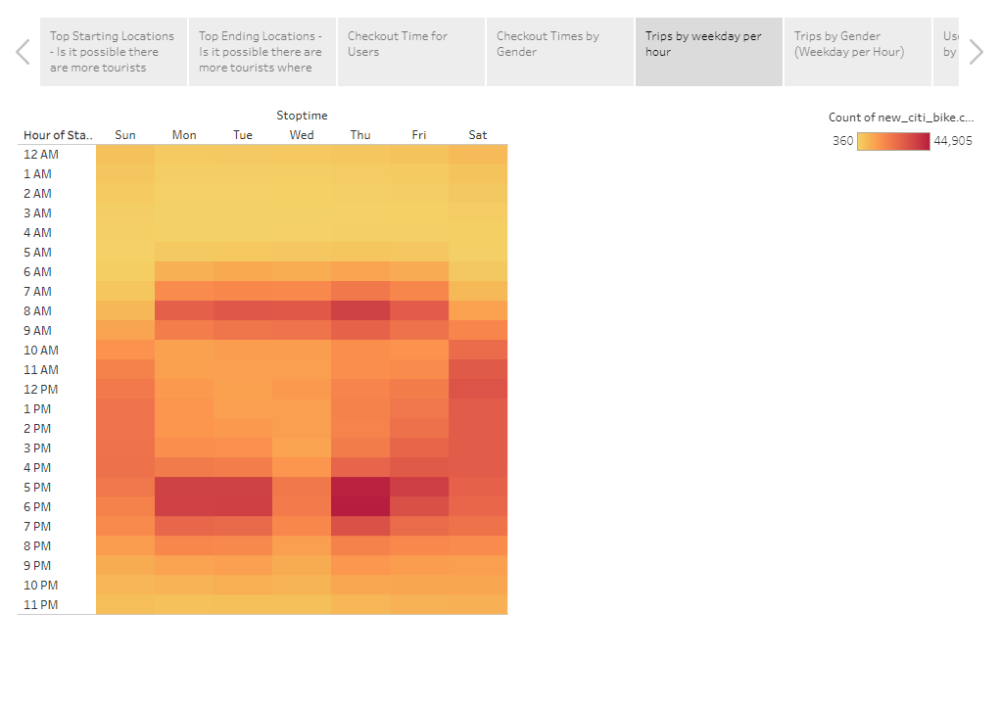

# NYC CitiBike Sharing

[Link to DashBoard](https://public.tableau.com/app/profile/bryce.ruppert/viz/CitiBikeAnalysis_16768460418310/NYCCitibikeAnalysis?publish=yes)

## Overview of Analysis
The purpose of this analysis was to look at the New York City bike sharing data and come up with questions we would want to ask. Once we had our questions, we filtered the data we had to answer questions like: What are the most popular start and stop locations? How long are bikes checked out for all riders and genders? How many trips are taken by the hour for each day of the week, for all riders and genders? What days of the week are users more likely to check out a bike? 

## Results
.
As shown in the graph above, the average time a bike is checked out is roughly 5 to 30 minutes. With the most bikes being checked out for 10 minutes.
.
As seen above, males are by far the gender that is checking out bikes the most.
.
According to this graph, bikes trips are happening most often in the morning between 7am and 9am, and in the afternoon between 5pm and 7pm. I am guessing this is a pretty common way for people to get to and from work. 
.
Again, in this graph it is shown that males are the gender that uses the bikes most often. 
.
This graph is showing user trips by weekday. Males are the most subscribed gender and use the bikes most often.

## Summary
Throughout this analysis there were two things that really stuck out to me. The male gender was by a longshot using the bikes the most. They were not only using the bikes the most but they had the most subscribers to the bikesharing. The other thing that stuck out to me is the times of day that people were checking out bikes. It was shown through the graphs that people were checking out bikes in the morning and in the afternoon right around the time people go to and leave work. So my assumption is that there are a good majority of people who use these bikes to get to and from work throughout the week. Two other visualizations that could be useful 
